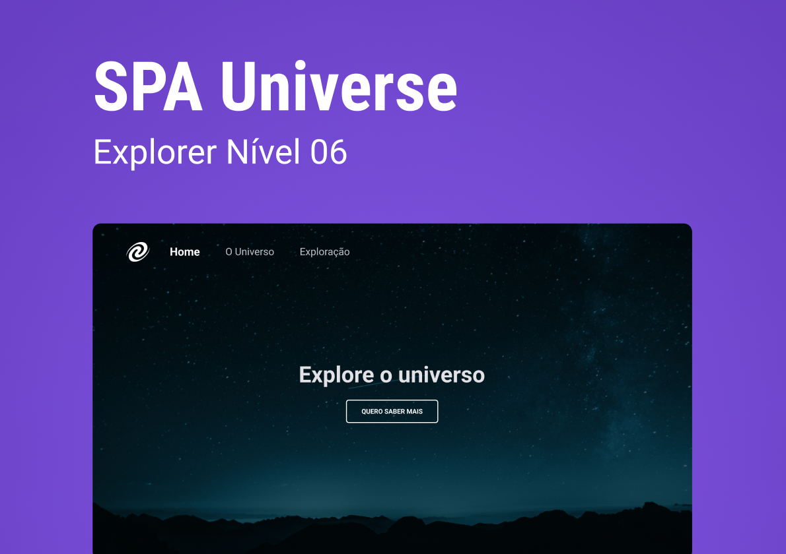

<h1 align="center"> SPA Universe </h1>

Neste projeto, foi desenvolvida uma SPA (Single-Page Application), um tipo de aplicação web onde todas as funcionalidades estão concentradas em uma única página. Isso permite que o usuário navegue pelas diferentes seções sem a necessidade de recarregar a página inteira.  

  

  

 <h2 align="center"><a href="https://kaiquerebonato.github.io/Jogo-da-Adivinhacao/" target="_blank">Projeto ao vivo</a></h2>

### 🚀 Tecnologias

Esse projeto foi desenvolvido com as seguintes tecnologias:

- HTML e CSS
- Javascript
- Git e Github
- Figma

### :memo: Licença

Esse projeto está sob a licença MIT.

---

Feito com ♥ por Kaique Rebonato :wave: